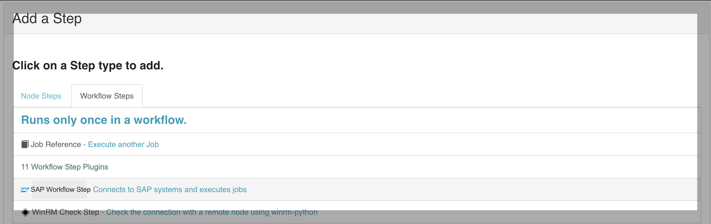
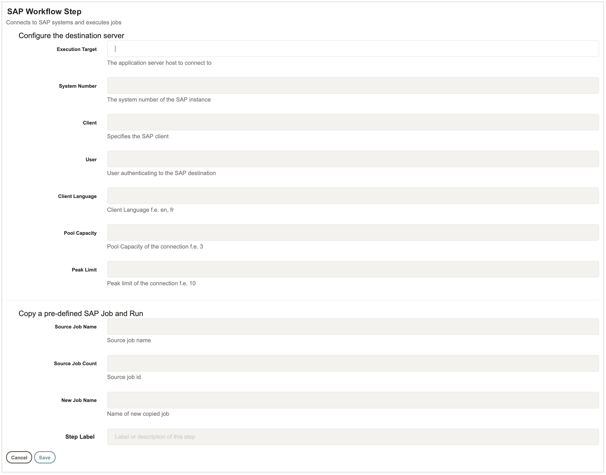
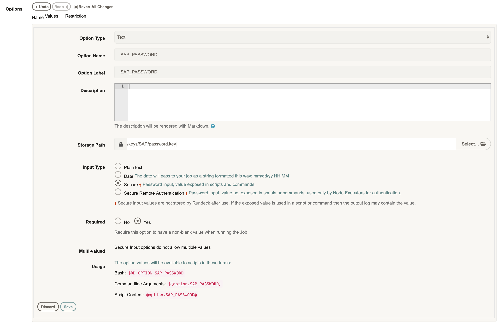

# rundeck sap plugin

This plugin has been designed to connect to SAP systems and trigger ABAP programs and process chains. This plugin executes BAPI function modules to copy a pre-defined SAP job, release the newly created SAP job and report their statuses.

## Build
Use the project gradle wrapper to build this project
`$ ./gradlew clean build`
or, the system gradle (if available)
`$ gradle clean build`

## Binary
The artifact/ jar can be found at this location
`/build/libs/rundeck-sap-plugin.x.y.jar`

## Installation
Copy the jar file to the `/libext` directory in the rundeck install path
`$RDECK_BASE/libext`
No restart of rundeck is required

## Setup

##### Edit a job and select SAP Workflow Step.

#### Fill out the input form to connect to a particular SAP destination and release jobs. All the fields are mandatory.

#### The connection requires a client password which you can supply via rundeck job options. Refer this screenshot to create an option whose input type can either be a Plain-Text or Secure (needs to be uploaded via Rundeck Key Storage)
 

## Configuration

Make sure you update the configuration values in the PluginConfig with your organization's standards or any applicable configurations.
<a href="src/main/java/org/rundeck/plugins/configurations/PluginConfig.java">Plugin Config</a>

If you need to use a signed/ certified sap jco library from your organization, then visit the SAP marketplace within your organization and downlaod the sapjco3 package. Update the build.gradle file to include include the package during compilation
<a href="build.gradle">Build.Gradle</a> 
